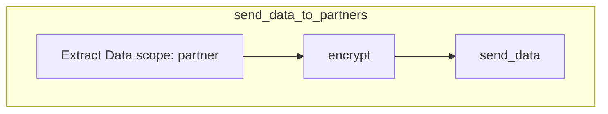

[[_TOC_]]

# sample

## send_data_to_partners 

### jobs
Name | cmd
---- | ---
extract_data | extrator --scope = partners \    --out = {{ OPS_DATA_PATH }}/extracted_data.json&quot
transform_data | transformer --scope = partners \   --out = {{ OPS_DATA_PATH }}/extracted_data.json&quot
send_data | cmd: sender --partner alll

#### send_data_to_partners

