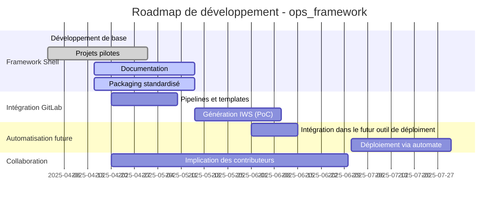

# Roadmap – ops_framework

## Vue d'ensemble

Cette feuille de route accompagne le développement du framework `ops_framework`, dans une logique d'outillage DevOps pour les équipes opérationnelles.

## Objectifs prioritaires

- [x] Développement du framework en shell
- [x] Intégration dans 3 projets pilotes avec dictionnaires de propriétés
- [ ] tests automatisés
- [ ] documentation automatisée et publication vers Conflence
- [ ] Documentation des usages (log, déploiement, rollback)
- [ ] Intégration GitLab complète (templates, pipelines de base)
- [ ] Préparation des packages pour future solution Tower maison
- [ ] Génération automatique des jobs IWS depuis GitLab

## Schéma d'évolution

## Points clés à venir

- Rendre les projets autosuffisants avec le framework
- Documenter les usages types et pièges courants et solutions standards pour y répondre
- Mettre en place des templates GitLab standard
- Définir le format des clés/valeurs pour les jobs IWS
- Spécifier l'automate (droits, sécurité, logs)

---

Les jalons seront mis à jour régulièrement en fonction des retours de l'équipe et de l'avancement.
