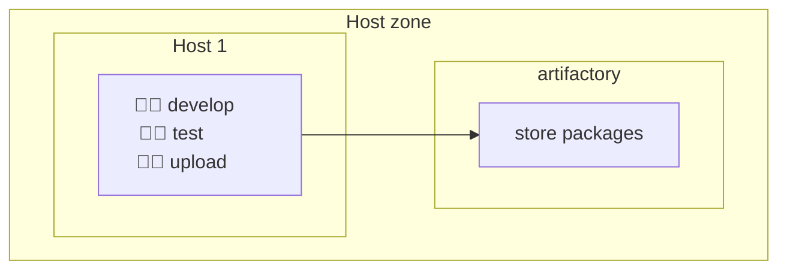
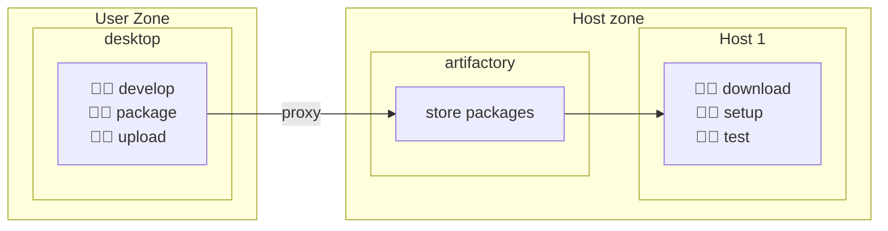
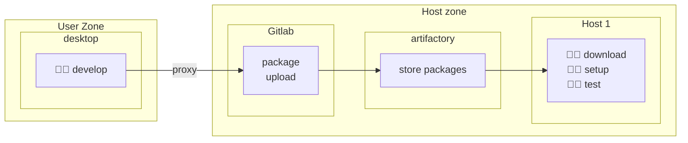
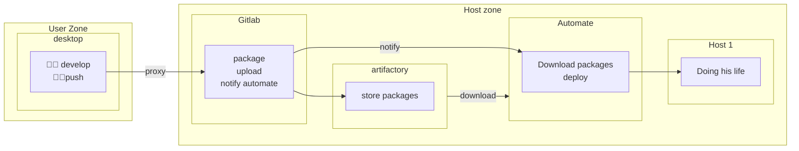

# Note

## Before

```mermaid
graph TB

subgraph hostzone["Host zone"]

  subgraph host_1["Host 1"]

  test["🧑‍🌾 develop&nbsp;&nbsp;&nbsp;&nbsp;&nbsp;&nbsp;<br>🧑‍🌾 test&nbsp;&nbsp;&nbsp;&nbsp;&nbsp;&nbsp;&nbsp;&nbsp;&nbsp;&nbsp;&nbsp<br>🧑‍🌾 upload"&nbsp;&nbsp;&nbsp;&nbsp;&nbsp;&nbsp;&nbsp;]
  end
  subgraph artifactory["artifactory"]
    artifactoryrole["store packages"]
  end
end
test --> artifactoryrole
```

## Flow without Gitlab

```mermaid
graph LR
subgraph userzone["User Zone"]
subgraph desktop["desktop"]
  develop["🧑‍🌾 develop<br>🧑‍🌾 package<br>🧑‍🌾 upload&nbsp;&nbsp;"]
  end
end
subgraph hostzone["Host zone"]
  subgraph artifactory["artifactory"]
    artifactoryrole["store packages"]
  end
  subgraph host_1["Host 1"]

  test["🧑‍🌾 download<br>🧑‍🌾 setup&nbsp;&nbsp;&nbsp;&nbsp;&nbsp;&nbsp;<br>🧑‍🌾 test&nbsp;&nbsp;&nbsp;&nbsp;&nbsp;&nbsp;&nbsp;&nbsp;&nbsp;"]
  end
end
develop -- proxy --> artifactoryrole --> test
```

## Flow with Gitlab

```mermaid
graph LR
subgraph userzone["User Zone"]
subgraph desktop["desktop"]
  develop["🧑‍🌾 develop"]
  end
end
subgraph hostzone["Host zone"]
  subgraph gitlab["Gitlab"]
    cicd["package<br>upload"]
  end
  subgraph artifactory["artifactory"]
    artifactoryrole["store packages"]
  end
  subgraph host_1["Host 1"]

  test["🧑‍🌾 download<br>🧑‍🌾 setup&nbsp;&nbsp;&nbsp;&nbsp;&nbsp;&nbsp;<br>🧑‍🌾 test&nbsp;&nbsp;&nbsp;&nbsp;&nbsp;&nbsp;&nbsp;&nbsp;&nbsp;"]
  end
end
develop -- proxy --> cicd --> artifactoryrole --> test
```

## Flow with automate

```mermaid
graph LR
subgraph userzone["User Zone"]
subgraph desktop["desktop"]
  develop["🧑‍🌾 develop<br/>🧑‍🌾push"]
  end
end
subgraph hostzone["Host zone"]
  subgraph gitlab["Gitlab"]
    cicd["package<br/>upload<br/>notify automate"]
  end
  subgraph artifactory["artifactory"]
    artifactoryrole["store packages"]
  end
  subgraph automate["Automate"]
    deploy["Download packages<br>deploy"]
  end
  subgraph host_1["Host 1"]

  test["Doing his life"]
  end
end
develop -- proxy --> cicd --> artifactoryrole 
artifactoryrole
cicd -- notify --> deploy --> test

artifactory -- download --> automate
```

